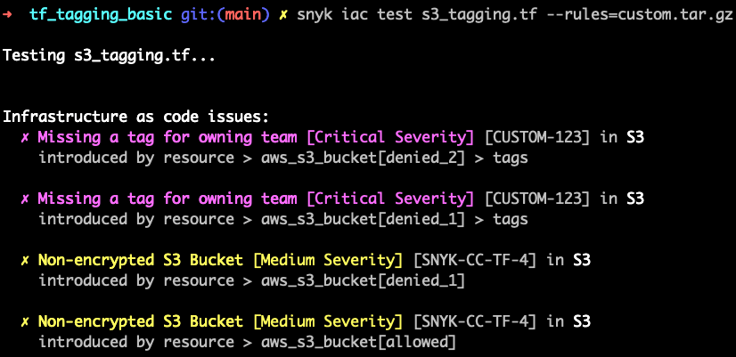

# Terraform Resource Tagging

## Overview

This rule demonstrates parsing a Terraform file and checking for the presence of a defined tag.

## Requirements

- Each AWS S3 Bucket must be tagged with the owning `Team`

## Example Terraform

from `s3_tagging.tf`

```hcl
# We expect all resources to adhere to our tagging standard of providing a
# `Team` for the owning team name

# This is an example of a resource that correctly adheres to the standard
resource "aws_s3_bucket" "allowed" {
  bucket = "my-tutorial-bucket"
  acl    = "private"

  tags = {
    Team = "rocket"
  }
}

# This fails as no tags are provided
resource "aws_s3_bucket" "denied_1" {
  bucket = "my-tutorial-bucket"
  acl    = "private"
}

# This fails as only Cost_Centre is provided, Team is missing.
resource "aws_s3_bucket" "denied_2" {
  bucket = "my-tutorial-bucket"
  acl    = "private"

  tags = {
    owning_team = "abc-123"
  }
}
```

## Rule

from `custom.rego`

```rego
deny[msg] {
	resource := input.resource.aws_s3_bucket[name]
	not resource.tags.Team
```

`resource := input.resource.aws_s3_bucket[name]` is referencing all of the s3 resources
`not resource.tags.Team` will return true if the `Team` property is **not** defined.

The final rego is as follows

```rego
deny[msg] {
	resource := input.resource.aws_s3_bucket[name]
	not resource.tags.Team

	msg := {
		"id": "124",
		"publicId": "CUSTOM-123",
		"title": "Missing a tag for owning team",
		"type": "custom",
		"subType": "S3",
		"severity": "critical",
		"policyEngineType": "opa",
		"issue": "There is no defined tag for the owning team",
		"impact": "Deployment will be blocked until this is resolved.",
		"resolve": "Set `aws_s3_bucket.tags.Team`",
		"msg": sprintf("input.resource.aws_s3_bucket[%s].tags", [name]),
		"references": [],
	}
}
```

## Result

Running this on the example file and you'll get this output


